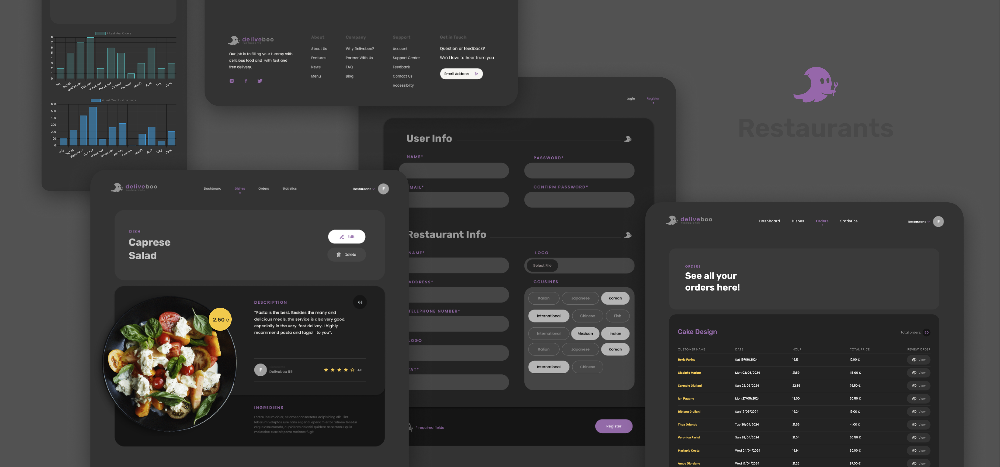

# DeliveBoo
DeliveBoo is a web app that allows users to order food for home delivery. Users can search for and order their favorite foods from trusted restaurants, all from the comfort of their home.

## Pages
- **Homepage**: Search for restaurants by type without refreshing the page.
- **Public Restaurant Menu**: View a restaurant's menu, select items, and add them to the cart.
- **Cart/Checkout**: Modify cart items and complete the order with a credit card payment.
- **Registered User Dashboard**: Manage personal data and dishes, view order summaries, and check order statistics.

## Technical Requirements

- **Validation**: All user inputs are validated client-side and server-side.
- **Payment System**: Uses Braintree for payments.
- **Responsive Design**: Accessible on both desktop and mobile devices.
- **Search Without Refresh**: Restaurant search works without page refresh.

## Functional Requirements

- **Restaurateur Registration**: Allows restaurateurs to register on the platform.
- **Add Dish**: Allows restaurateurs to add dishes.
- **Search Restaurants**: Allows visitors to search by restaurant type.
- **View Menu**: Allows visitors to view a restaurant’s menu.
- **Order Payment**: Allows visitors to pay for their order.
- **View Orders Summary**: Allows restaurateurs to view order summaries.
- **View Orders Statistics**: Allows restaurateurs to view order statistics.

**Note:** This project was developed as part of a learning exercise to demonstrate my skills in Vue.js and Laravel.

### Thanks for Watching! 😊